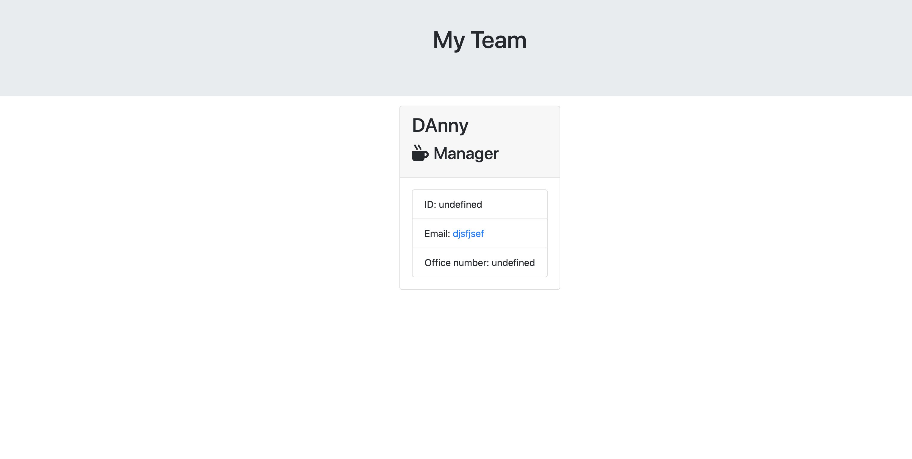
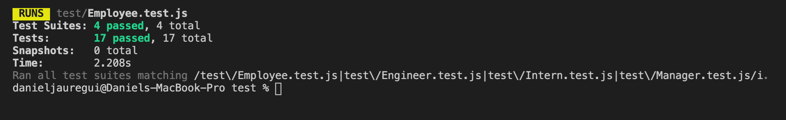
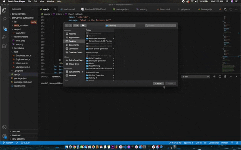

# Team-gen
As developers we are challenged on our AGILE methods of work. This is to see where a person stands as far as disciplined developmental procedure. We are given a template in this assignment to modify. Using jest, a javascript library, we are testing the results of our code to make sure we have code purely based on correctedness.
## Site Picture

## Tests functional 

## Site Functionality

### Installing
This program uses two NPM package dependencies
* Inquirer
* Jest
Inquirer is a javascript library that allows a programmer to code a series of prompts in the terminal and receive values from the responses. This is effective in the development of this application. We need to ask questions to retrieve values from the user in order to generate the site. 
<br>
Testing with Jest allows us to develop functional code quicker than running it into the terminal over and over again. We are given a test template that tests the result of various retrival methods from the entries. Jest is a javascript library that ensures the correctedness of a javascript codebase. 
<br>
In order to install both libraries, follow these instructions
```
Open terminal
```

```
Locate the file you want to install your NPM packages
```

```
If your file has a package.json file with dependencies installed do the following in terminal: 
npm install

If not and there is not dependencies OR a .json file do the following in terminal: 
npm init -y

Then:
npm install *dependency_name*
```

## Getting started 
We are given a set of files if we choose to use them. I chose not to use the files other than the test files. The test files are the most useful for running the tests with jest and also having a general idea of where the project should be headed. I went ahead and created one HTML file that the function will append all the user information into. 

# Built with 
* HTML
* CSS
* Boostrap
* Inquirer
* Jest 
* Javascript
* Node

## Deployed Link 
* [Link to Github repo](https://github.com/Kionling/team-gen)

## Authors 
* [Daniel Jauregui](https://github.com/Kionling)

## Acknowledgements

* My Dad. Absolute cheerleader. Love you dad. 
* W3schools
* Gitlab repository
* Code Drills